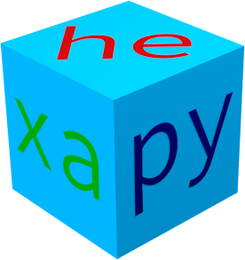

.. hexapy documentation master file, created by
   sphinx-quickstart on Tue Nov  1 18:09:45 2016.
   You can adapt this file completely to your liking, but it should at least
   contain the root `toctree` directive.

Welcome to hexapy's documentation!
==================================

Contents:

.. toctree::
   :maxdepth: 2

   installation
   introduction
   classes

hexapy is a Python module providing tools for easy generation of 8-node hexahedral meshes for simple geometries. Currently supported geometries include:

* box

* ellipsoid
* half-ellipsoid
* quarter-ellipsoid
* eighth-ellipsoid

* elliptical cylinder
* half-elliptical cylinder
* quarter-elliptical cylinder

Element divisions or edge length can be set for each principal direction. Default sets are generated for elements, nodes, and faces. Additional sets can be defined by the user.

An assembly of meshes will be constructed with repeated calls to mesh generation functions. Each mesh in the assembly can be rigidly transformed to appropriately position and orient it in the assembly.

Currently, the meshes can be written in Abaqus format. The module will be extended to support additional formats in the future.

Indices and tables
==================

* :ref:`genindex`
* :ref:`modindex`
* :ref:`search`

