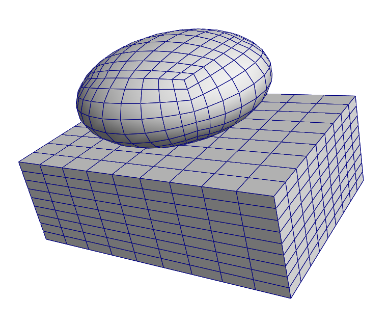

Introduction
============

.. toctree::
   :maxdepth: 1
   :glob:

Example 1 - An ellipsoid
--------------------------------------

.. code-block:: python

   import hexapy

   # instantiate a Mesher object, mesh
   mesh = hexapy.Mesher()

   # create an ellipsoid with major axis length 1.0 and minor axis length 0.5
   mesh.makeEllipsoid(r_major=1.0, r_minor=0.5)

   # write the mesh to file named ellipsoid.inp in Abaqus format
   mesh.writeToFile(filename="ellipsoid.inp", format="abaqus")

   # translate and rotate the ellipsoid
   # mesh_index=0 because the ellipsoid was created first and is the only created mesh
   # translation is the translation vector
   # rx, ry, and rz are the rotations in degrees about the x, y, and z axes, respectively
   mesh.applyRigidTransform(mesh_index=0, translation=[0.0, 0.0, 1.0], rx=45.0, ry=20.0, rz=30.0)

   #write transformed mesh to file
   mesh.writeToFile(filename="transformed_ellipsoid.inp", file_format="abaqus")

Example 2 - An assembly
-----------------------

.. code-block:: python

   import hexapy

   # instantiate a Mesher object, mesh
   mesh = hexapy.Mesher()

   # create a box with x edge length of 3.0, y edge length of 2.0, and z edge length of 1.0
   mesh.makeBox(x_length=3.0, y_length=2.0, z_length=1.0)

   # create an ellipsoid with major axis length 2.0 and minor axis length 1.0
   mesh.makeEllipsoid(r_major=1.0, r_minor=0.5)

   # translate the ellipsoid
   # this time mesh_index=1 because the ellipsoid was created second
   mesh.applyRigidTransform(mesh_index=1, translation=[0.0, 0.0, 1.0])

   #write transformed mesh to file
   mesh.writeToFile(filename="assembly.inp", file_format="abaqus")

   The resulting assembly of ellipsoidal and box meshes from the example 2 code.
